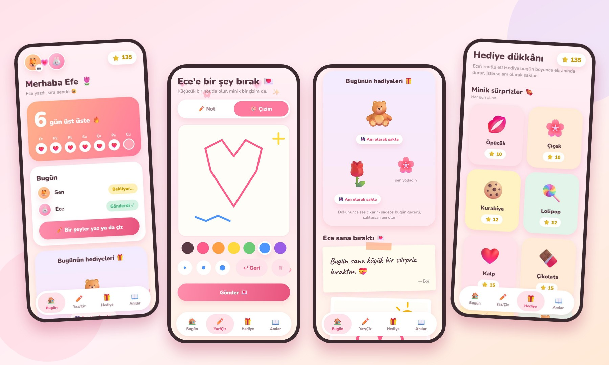
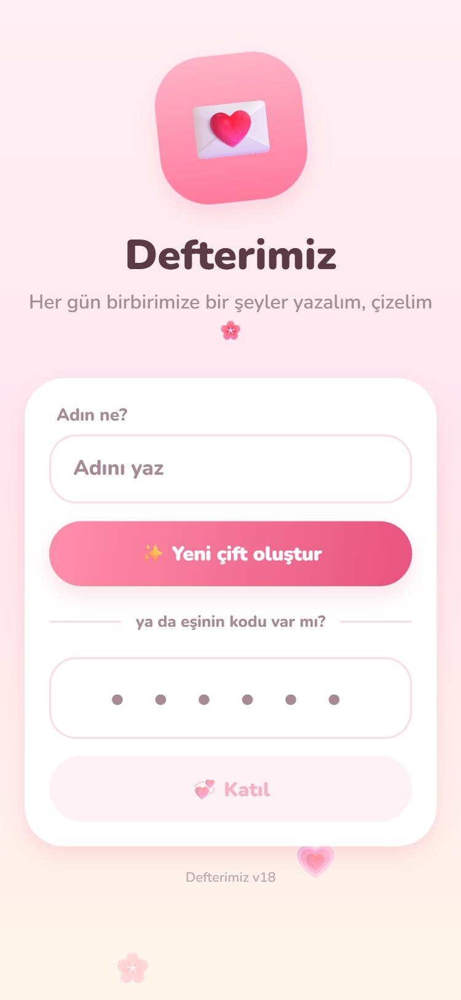
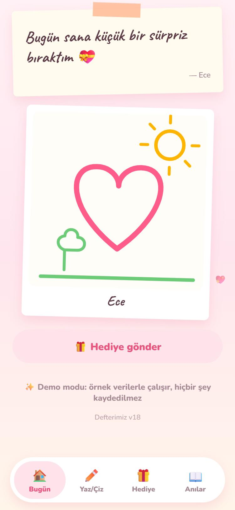
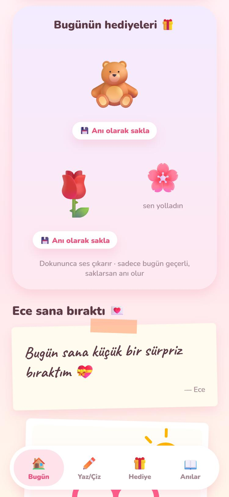
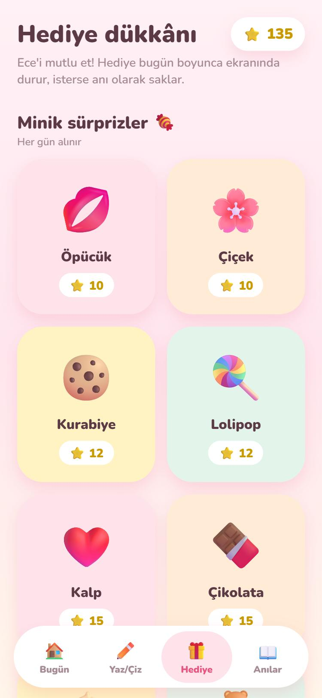
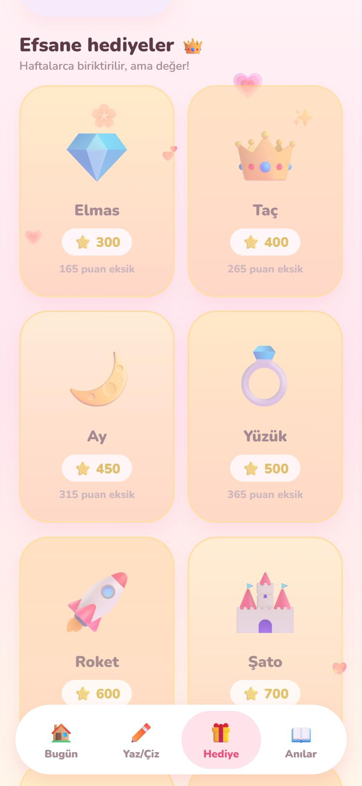
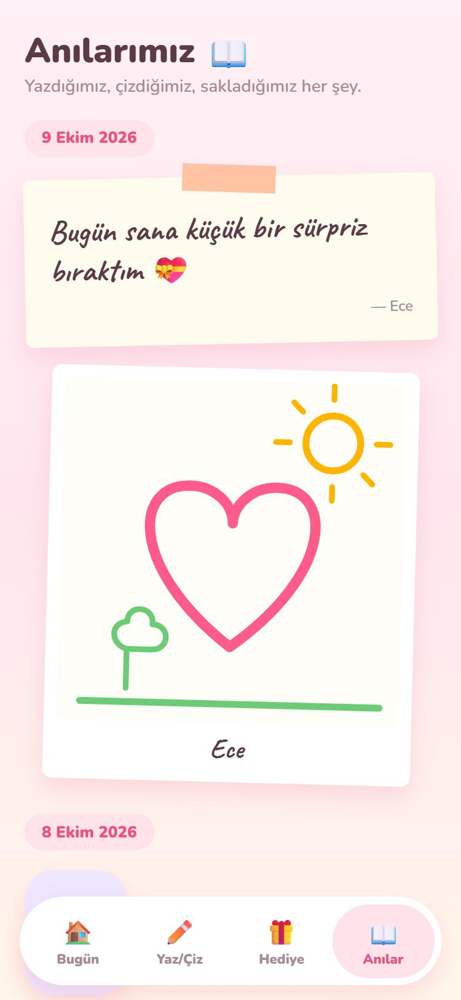

<p align="center">
  
</p>

<h1 align="center">Defterimiz</h1>

<h3 align="center">Sevgililer için günlük not, çizim, seri ve hediye uygulaması 💌</h3>

<p align="center">
  <a href="https://ciftapp-e6cf9.web.app/?demo=1"><b>▶ Canlı demo</b></a>
  &nbsp;·&nbsp;
  <a href="#-nasıl-yapıldı">Teknik notlar</a>
  &nbsp;·&nbsp;
  <a href="#-kurulum">Kurulum</a>
</p>

<p align="center">
  
  
  
  
  
  
</p>

<p align="center">
  
</p>

---

## 💗 Proje hakkında

**Defterimiz**, iki kişinin her gün birbirine küçük bir şeyler bırakması için yapılmış bir uygulamadır. Her gün biri bir not yazar ya da parmağıyla bir şey çizer; ikisi de o gün bir şey bıraktıysa **seri** devam eder. Bıraktıkça **puan** kazanılır, puanlarla çiçek, ayıcık, kalp gibi minik hediyeler (ya da 👑 taç, 🏰 şato, 🌍 dünya gibi dev olanlar) yollanır.

Hediyeler yollandığı gün karşı tarafın ana ekranında süzülür; dokununca ses çıkarır, titrer, emojiler saçılır. İsterse "anı olarak sakla" der, saklamazsa ertesi gün kaybolur.

> Uygulama **App Store ya da Play Store'a ihtiyaç duymadan** telefona kurulur: tarayıcıdan "Ana Ekrana Ekle" ile gerçek bir uygulama gibi açılır (PWA). Hesap, e-posta ya da şifre yok; biriniz çift oluşturur, 6 harfli kodu eşine yollar.

## ✨ Öne çıkanlar

- 💞 **Kodla eşleşme:** hesap açmadan, 6 harfli bir kodla iki telefon birbirine bağlanır
- ✏️ **Not & 🎨 Çizim:** notlar bantlı kâğıt, çizimler polaroid olarak görünür; çizim için 7 renk, 3 kalınlık, geri al
- 🔥 **Seri:** ikiniz de o gün bir şey bırakırsanız gün sayılır; ana ekranda son 7 günün kalpli takvimi
- ⭐ **Puan:** her not ya da çizim +10 puan (günde 3 tanesi puan getirir)
- 🎁 **30 hediye, 3 grup:** *minik sürprizler* (10–25), *özel hediyeler* (35–200), *efsane hediyeler* (300–2000); her birinin kendi sesi var
- 🔊 **Canlı hediye ekranı:** süzülen emojiler, dokununca ses + titreşim + saçılan parçacıklar
- 📖 **Anılar:** gün gün gruplanmış tüm not, çizim ve saklanan hediyeler
- 📸 **Profil fotoğrafı:** galeriden seçilir, ortadan kırpılıp küçültülür
- 🔔 **Bildirim:** eşin bir şey bırakınca telefonuna haber düşer; art arda gelenler "3 şey bıraktı" diye birleşir
- 📲 **Kolay kurulum:** siteye girince alttan çıkan "indir" penceresi (Android'de tek dokunuş, iPhone'da adım adım yönerge)
- 🎭 **Demo modu:** adrese `?demo=1` eklenince örnek verilerle, hiçbir şey kaydetmeden denenebilir

<p align="center">
  
  
  
</p>
<p align="center">
  
  
  
</p>

<sub>Ekran görüntüleri uygulamanın demo modundan alınmıştır; içindeki kişiler ve notlar örnektir.</sub>

## 🛠 Nasıl yapıldı

- **Uygulama:** [Expo](https://expo.dev) (React Native) + TypeScript. Web için `react-native-web`, yani tek kod tabanı hem telefonda hem tarayıcıda çalışır.
- **Veritabanı & giriş:** Firebase Authentication (anonim giriş) ve Cloud Firestore. Veriler iki telefonda anında eşitlenir (gerçek zamanlı dinleyiciler).
- **Yayın:** Firebase Hosting. Uygulama bir PWA: `manifest`, ikonlar ve `service worker` ile ana ekrana eklenir.
- **Çizim:** `react-native-svg` ile parmak hareketleri SVG yollarına çevrilir ve küçük, ölçekten bağımsız bir sanal tuvalde saklanır; böylece her ekran boyunda aynı görünür.
- **Ses:** `expo-audio`. Tüm sesler ([`assets/sounds`](assets/sounds)) sentezlenerek üretilmiş küçük `.wav` dosyaları (miyav, havlama, motor, tantana, şampanya...), dış dosya yok.
- **Bildirim:** Standart Web Push (VAPID, ES256 imzalı). Küçük bir sunucusuz fonksiyon ([`worker/`](worker) Cloudflare ya da [`push-api/`](push-api) Vercel) imzalı isteği push servisine iletir. Bildirim metni cihazdaki [`public/sw.js`](public/sw.js) içinde olduğu için notların içeriği hiçbir dış servisten geçmez.
- **Güvenlik:** Firestore kuralları ([`firestore.rules`](firestore.rules)) bir çiftin verisini yalnızca o çiftin iki üyesine açar. Eşleşme kodları tek tek okunabilir ama listelenemez. Bildirim aracısı yalnızca uygulamanın kendi alan adından gelen isteklere yanıt verir ve yalnızca bilinen push servislerine istek atar.
- **Tasarım:** pastel degrade, uçuşan kalpler, Nunito ve el yazısı (Caveat) yazı tipleri, bantlı not kâğıdı ve polaroid kartları.
- **Demo modu:** [`src/DemoProvider.tsx`](src/DemoProvider.tsx) aynı arayüzü Firebase yerine bellekteki örnek veriyle besler; yani demo, gerçek uygulamayla aynı kodu çalıştırır.

## 📁 Klasörler

```
App.tsx                  Giriş noktası, alt menü
src/
  data.tsx               Firebase verisi: çift, notlar, hediyeler, puan, seri
  DemoProvider.tsx       Örnek verili demo modu
  theme.ts               Renkler ve 30 hediyelik katalog
  ui.tsx                 Ortak parçalar: kartlar, düğmeler, çizim tuvali, polaroid...
  sounds.ts              Ses çalma
  push.ts / pushConfig.ts  Bildirim izni, abonelik, test
  InstallBanner.tsx      "Uygulamayı indir" penceresi
  screens/               Onboarding, Home, Compose, Shop, Memories
public/                  PWA dosyaları: manifest, ikonlar, sw.js
worker/                  Bildirim aracısı (Cloudflare Worker)
push-api/                Aynı aracının Vercel sürümü
firestore.rules          Güvenlik kuralları
scripts/                 İkon üretimi ve derleme sonrası PWA ayarları
screenshots/             README görselleri
```

## 🚀 Kurulum

Gerekenler: Node.js 20+ ve ücretsiz bir Firebase hesabı.

1. **Firebase projesi** açın ([console.firebase.google.com](https://console.firebase.google.com)):
   - **Authentication → Sign-in method → Anonymous**'ı etkinleştirin.
   - **Firestore Database** oluşturun (Realtime Database değil).
   - Proje ayarlarından bir **Web uygulaması** ekleyin ve ayarları [`src/firebaseConfig.ts`](src/firebaseConfig.ts) dosyasına yapıştırın. [`.firebaserc`](.firebaserc) içindeki proje adını da değiştirin.
2. Paketleri kurun:
   ```bash
   npm install
   ```
3. Telefonda denemek için (Expo Go ile, aynı Wi-Fi):
   ```bash
   npx expo start
   ```
4. Yayınlamak için (web sitesi + Firestore kuralları):
   ```bash
   npx firebase-tools login
   npm run deploy
   ```
   Çıkan `https://PROJE.web.app` adresini telefondan açıp **Ana Ekrana Ekle** deyin. Veritabanına dokunmadan denemek için adrese `?demo=1` ekleyin.

### Bildirimleri açmak (isteğe bağlı)

1. Bir VAPID anahtar çifti üretin ve açık anahtarı [`src/pushConfig.ts`](src/pushConfig.ts) ile `worker/wrangler.toml` içine yazın:
   ```bash
   node -e "const c=require('crypto'),{privateKey:k,publicKey:p}=c.generateKeyPairSync('ec',{namedCurve:'prime256v1'});const j=p.export({format:'jwk'}),b=s=>Buffer.from(s,'base64url');console.log('açık:',Buffer.concat([Buffer.from([4]),b(j.x),b(j.y)]).toString('base64url'));require('fs').writeFileSync('worker/private.jwk.json',JSON.stringify(k.export({format:'jwk'})))"
   ```
2. Aracıyı yayınlayın (`worker/private.jwk.json` gizli kalır, depoya girmez):
   ```bash
   cd worker
   npx wrangler login
   npx wrangler deploy
   Get-Content private.jwk.json | npx wrangler secret put VAPID_PRIVATE_JWK
   ```
3. Çıkan adresi `src/pushConfig.ts` içindeki `PUSH_URL`'ye yazıp yeniden `npm run deploy` yapın.

> Bazı ülkelerde `workers.dev` alan adı engelli olabilir. O durumda aynı işi yapan [`push-api/`](push-api) klasörünü Vercel'e yükleyin (`npx vercel --prod`) ve adresini `PUSH_URL`'ye `/api/push` ekleyerek yazın.

## 🔒 Sınırlar

- Giriş **cihaza bağlı (anonim)**. Uygulamayı silerseniz ya da çıkış yaparsanız aynı çifte geri dönemezsiniz.
- Puanlar telefonda hesaplanır; iki kişilik bir uygulama için yeterli, ama hile yapılamaz demek değil.
- **iPhone'da bildirim** için iOS 16.4+ ve uygulamanın ana ekrana eklenmiş olması gerekir.
- Gizli anahtarlar (`worker/private.jwk.json`, `push-api/lib/keys.js`) `.gitignore` ile dışarıda tutulur. Firebase web ayarları gizli değildir, güvenliği kurallar sağlar.

## 🗺️ Yapılabilecekler

- E-posta ile giriş (çıkış yapınca çifte geri dönebilmek için)
- Seri bonusu, özel gün çift puanı
- Bildirimde gönderenin adı

## 📄 Lisans

**Tüm hakları saklıdır.** Kod, portfolyo amacıyla herkese açıktır: **okuyabilir ve inceleyebilirsiniz**, ama izinsiz kopyalayamaz, değiştirip yayımlayamaz ya da kendi ürününüzde kullanamazsınız. Ayrıntılar için [LICENSE](LICENSE), kullanılan açık kaynak bileşenler için [THIRD_PARTY_LICENSES.md](THIRD_PARTY_LICENSES.md). Güvenlik açığı bildirimi için [SECURITY.md](SECURITY.md).

---

<p align="center">Sevgiyle yapıldı 💗</p>
